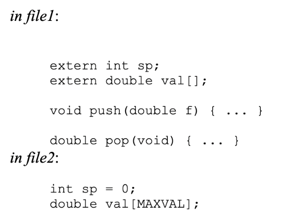

# lesson-5


## Basic Functions
### Arguments & Return Values
- Functions splits up the main function to more readable chunks
- Generally, you don't want functions to be too large (<100 lines)

Functions are in the form:
```
return-type function-name(parameter declarations, if any)
{
  declarations
  statements
  return
}
```
- The function declaration, called a function prototype, has to match with the function definition. It is an error if the definition of a function or any uses of it does not agree with its prototype.
- Parameter names do not have to match, and are in fact optional. The prototype for a power() function can be written as ```int power(int m, int n)```; Or ```int power(int, int)```. Later in the file the function will be defined as 

```
int power(int base, int n) {...}
```
- The function must be declared and or defined before it is used in main.

#### Example of why you should use a function:
- reduce the amount of duplicate code as shown below
```c
#include <stdio.h>

int main ()
{
  float fahr1 = 41.5; 
  float fahr2 = 29.1; 
  
  if (fahr1<=32) { 
    printf("\nBelow");
  } else if (fahr1>32) {
    printf("\nAbove");
  }
  
  if (fahr2<=32) {
    printf("\nBelow");
  } else if (fahr2>32) {
    printf("\nAbove");
  }
  
  return 0;
}
```

#### Above code rewritten:
- reduce the amount of duplicate code as shown below
```c
#include <stdio.h>

void isFreezing(float temperature)
{
    if (temperature<=32.0) {
        printf("Below\n");
    } else if (temperature>32.0) {
        printf("Above\n");
    }
}

int main ()
{
    float fahr1 = 41.5;
    float fahr2 = 29.1;

    isFreezing(fahr1);
    isFreezing(fahr2);

    return 0;
}

```

## Example of Using a Function
- The variables used in power are local to the function, the i in power() is not related to the i in main(). These local variables are also referred to as automatic variables. 

- Just as the power function returns a value to the main function, the main function returns a value to its caller, which in effect is the environment in which the program was executed. Typically a return value of zero implies normal termination; non-zero values signal unusual or erroneous termination conditions.

```c
#include <stdio.h>

// K&R pg. 24-25
// power function

// Function prototype at the beginning
int power(int m, int n);

int main()
{
    int i;
    for (i=0; i<10; ++i)
        printf("%d %d %d\n", i, power(2,i), power(-3,i));
    return 0;
}

// power: raise base to n-th power; n >= 0
int power(int base, int n)
{
    int i, p;
    p = 1;
    for (i=1; i<=n; ++i)
        p = p * base;
    return p;
}
```
It is good to use functions - to make the code more readable, re-usability of functions, …

## External Variables 
The alternative to local variables are external variables. These are variables that are external to all functions, that is variables that can be accessed by name by any function. They are globally accessible. 

The external variable must be defined, exactly once, outside of any function; this sets aside storage for it. The variable must also be declared in each function that wants to access it; this states the type of the variable.

The declaration may be an explicit extern statement or may be implicit from context. The extern declaration can be omitted if the definition of the external variable occurs in the source file before its use in a particular function. In fact, its common practice to place definitions of all external variables at the beginning of the source file, and then omit all extern declarations. The extern declarations below are redundant.

If the program is in several source files, and a variable is defined in file1 and used in file2 and file3, then extern declarations are needed in file2 and file3 to connect the occurrences of the variable. The usual practice is to collect extern declarations of variables and functions in a separate file, historically called a header, that is included by #include at the front of each source file. The suffix .h is convention for header files.


- External variables are defined outside of any function, and thus potentially available to many functions. 
- Functions themselves are always external, because C does not allow functions to be defined inside other functions. 
- External linkage - all references to them by the same name, even from functions compiled separately, are references to the same thing.

_Definition_ = place where the variable is created or assigned storage

_Declaration_ = place where the nature of the variable is stated but no storage is allocated

```c
#include <stdio.h>
#define MAXLINE 1000

// external variables are declared here with their type, so storage is allocated for them
int max;
char line[MAXLINE];
char longest[MAXLINE];

int getnewline(void);
void copy(void);

int main()
{
    int len;
    extern int max;
    extern char longest[];

    max = 0;
    while ((len = getnewline()) > 0)
    {
        printf("\tlen: %d max: %d\n", len, max);
        if (len > max)
        {
            max = len;
            copy();
        }
    }

    if (max > 0)
        printf("\nlongest line: %s", longest);

    return 0;
}

int getnewline(void)
{
    int c, i;
    extern char line[];
    for (i = 0; i < MAXLINE - 1 && (c = getchar()) != EOF && c != '\n'; ++i)
    {
        line[i] = c;
    }

    if (c == '\n')
    {
        line[i] = c;
        ++i;
    }
    line[i] = '\0';
    printf("processing line: %s", line);

    return i;
}

void copy(void)
{
    int i;
    extern char line[], longest[];

    i = 0;
    while ((longest[i] = line[i]) != '\0')
        ++i;
    printf("\tcopied new longest: %s", longest);
}	
```

## Scope Rules
The scope of a name is the part of the program within which the name can be used. For an automatic variable declared at the beginning of a function, the scope is the function in which the name is declared. This is true of the parameters of the function, which are in effect local variables. 

The scope of an external variable or a function lasts from the point at which it is declared to the end of the file being compiled. In the scope they can be used by just naming them. These external variables can be used outside of this scope if they are declared with the term “extern”.

In C language definition and declaration for a variable takes place at the same time. i.e. there is no difference between declaration and definition.
If the lines 
```c
int sp;
double val[MAXVAL];
```
appear outside of any function, they define the external variables sp and val, cause storage to be set aside and also serve as the declarations for the rest of that source file. On the other hand, the lines
```c
extern int sp;
extern double val[];
```
Declare for the rest of the source file that sp is an int and that val is a double array (whose size is determined elsewhere), but they do not create the variables or reserve storage for them. 

Array sizes must be specified with the definition, but are optional with an extern declaration. The initialization of an external variable goes only with the definition (you should nor declare and initialize a value with extern). So in the case that you defined the variables in a separate file1, then in file 2 it would look like:


https://www.geeksforgeeks.org/difference-between-definition-and-declaration/ 
Declaration of a function provides the compiler with the name of the function, the number and type of arguments it takes, and its return type. For example, consider the following code,

```c
int add(int, int);
```
Here, a function named add is declared with 2 arguments of type int and return type int. Memory will not be allocated at this stage. Definition of the function is used for allocating memory for the function. For example, consider the following function definition,
```c
int add(int a, int b)
  {
    return (a+b);
  }
```
During this function definition, the memory for the function add will be allocated.


Use extern variables carefully - using too much can lead to programs where data connections are not all obvious - variables can be changs in unexpected and even inadvertent ways, and the program is hard to modify. 


## GOTO
DO NOT USE, this can usually be replaced with other more readable code

Allows you to go to other lines in your program directly

The one situation where it might be helpful is if you have multiple nested loops, and you want to exit out of all the loops. Goto can do this with one statement, instead of using many breaks as breaks only exit out of the innermost loop.

For this reason we will skip an example on goto.


## Input & Output
### scanf
- int scanf(const char *format, ...) reads formatted input from stdin. https://www.tutorialspoint.com/c_standard_library/c_function_scanf.htm
- Don't worry about what the syntax means for now
```c
#include <stdio.h>

// K&R pg. 158
// rudimentary calculator

int main()
{
    double sum, v;
    sum = 0;
    while (scanf("%lf", &v) == 1)
        printf("\t%.2f\n", sum+=v);

    return 0;
}
```


# TIC-TAC-TOE (Example by Prof. Sable)

#### REQUIREMENTS
Have a tic-tac-toe board
Allow a user to choose to play first or second
Have a computer player to choose logical moves
Determine the win/lose/tie conditions
Ask a player if they want to play again

#### FUNCTION PROTOTYPES
```c
void init_board(void);
void draw_board(void);
int user_first(void);
int play_again(void);
int symbol_won(char);
int find_win(char);
int middle_open(void);
int find_corner(void);
int find_side(void);
void computer_move(void);
int square_valid(int);
void player_move(void);
void play_game(void);
```

#### GLOBAL VARIABLES
```c
char board[3][3];
char computer, user;
```

#### MAIN
```c
/* 
 * Initialize the board, ask who goes first, play a game,
 * ask if the user wants to play again.
 */
int main(void)
{
  while(1)
  {
    init_board();
    if (user_first())
    {
      computer = 'O';
      user = 'X';
    }
    else
    {
      computer = 'X';
      user = 'O';
    }
    play_game();
    if (!play_again())
      break;
  }
  return 0;
}
```

#### BOARD FUNCTIONS
```c
/* Make sure board starts off empty. */
void init_board(void)
{
  int row, col;

  for (row = 0; row < 3; row++)
    for (col = 0; col < 3; col++)
      board[row][col] = ' ';

  return;
}

/* Display the board to standard output. */
void draw_board(void)
{
  int row, col;

  printf("\n");
  for (row = 0; row < 3; row++)
  {
    printf("   *   *   \n");
    printf(" %c * %c * %c \n",
       board[row][0], board[row][1], board[row][2]);
    printf("   *   *   \n");
    if (row != 2)
      printf("***********\n");
  }
  printf("\n");

  return;
}
```

#### GAME FLOW FUNCTIONS
```c
/*
 * Ask if user wants to go first.
 * Returns 1 if yes, 0 if no.
 */
int user_first(void)
{
  char response;

  printf("Do you want to go first? (y/n) ");
  do
  {
    response = getchar();
  } while ((response != 'y') && (response != 'Y') &&
       (response != 'n') && (response != 'N'));

  if ((response == 'y') || (response == 'Y'))
    return 1;
  else
    return 0;
}

/*
 * Ask if user wants to play again.
 * Returns 1 if yes, 0 if no.
 */
int play_again(void)
{
  char response;

  printf("Do you want to play again? (y/n) ");
  do
  {
    response = getchar();
  } while ((response != 'y') && (response != 'Y') &&
       (response != 'n') && (response != 'N'));

  if ((response == 'y') || (response == 'Y'))
    return 1;
  else
    return 0;
}
```
#### GAMEPLAY
```c
/* Loop through 9 turns or until somebody wins. */
void play_game(void)
{
  int turn;

  for (turn = 1; turn <= 9; turn++)
  {
    /* Check if turn is even or odd 
       to determine which player should move. */
    if (turn % 2 == 1)
    {
      if (computer == 'X')
        computer_move();
      else
        player_move();
    }
    else
    {
      if (computer == 'O')
        computer_move();
      else
        player_move();
    }

    draw_board();

    if (symbol_won(computer)) {
      printf("\nI WIN!!!\n\n");
      return;
    }
    else if (symbol_won(user)) {
      printf("\nCongratulations, you win!\n\n");
      return;
    }
  }

  printf("\nThe game is a draw.\n\n");
  return;
}
```
#### PLAYER MOVE FUNCTIONS
```c
/* Have the user choose a move. */
void player_move(void)
{
  int square;
  int row, col;

  do
  {
    printf("Enter a square: ");
    scanf("%d", &square);
  } while (!square_valid(square));

  row = (square - 1) / 3;
  col = (square - 1) % 3;

  board[row][col] = user;

  return;
}
```

#### COMPUTER MOVE FUNCTIONS
```c
/*
 * If middle square is empty, return 5;
 * otherwise return 0.
 */
int middle_open(void)
{
  if (board[1][1] == ' ')
    return 5;
  else
    return 0;
}

/* 
 * Return the number of an empty corner, if one exists;
 * otherwise return 0.
 */
int find_corner(void)
{
  if (board[0][0] == ' ')
    return 1;
  if (board[0][2] == ' ')
    return 3;
  if (board[2][0] == ' ')
    return 7;
  if (board[2][2] == ' ')
    return 9;

  return 0;
}

/*
 * Return the number of an empty side square, if one exists;
 * otherwise return 0.
 */
int find_side(void)
{
  if (board[0][1] == ' ')
    return 2;
  if (board[1][0] == ' ')
    return 4;
  if (board[1][2] == ' ')
    return 6;
  if (board[2][1] == ' ')
    return 8;

  return 0;
}

/* Choose a move for the computer. */
void computer_move(void)
{
  int square;
  int row, col;

  /* Use first strategy rule that returns valid square */
  square = find_win(computer);
  if (!square)
    square = find_win(user);
  if (!square)
    square = middle_open();
  if (!square)
    square = find_corner();
  if (!square)
    square = find_side();

  printf("\nI am choosing square %d!\n", square);

  row = (square - 1) / 3;
  col = (square - 1) % 3;

  board[row][col] = computer;

  return;
}
```
#### WIN CONDITION
```c
/* Check if the given symbol has already won the game. */
int symbol_won(char symbol)
{
  int row, col;

  for (row = 0; row < 3; row++)
  {
    if ((board[row][0] == symbol) &&
    (board[row][1] == symbol) &&
    (board[row][2] == symbol))
      return 1;
  }

  for (col = 0; col < 3; col++)
  {
    if ((board[0][col] == symbol) &&
    (board[1][col] == symbol) &&
    (board[2][col] == symbol))
      return 1;
  }

  if ((board[0][0] == symbol) &&
      (board[1][1] == symbol) &&
      (board[2][2] == symbol))
    return 1;

  if ((board[0][2] == symbol) &&
      (board[1][1] == symbol) &&
      (board[2][0] == symbol))
    return 1;

  return 0;
}

/* 
 * Find a win, if any, for the given symbol.
 * If a winning square exists, return the square;
 * otherwise, return 0.
 */
int find_win(char symbol)
{
  int square, row, col;
  int result = 0;

  /*
   * Loop through the 9 squares.
   * For each, if it is empty, fill it in with the given
   * symbol and check if this has resulted in a win.
   * If so, keep track of this square in result.
   * Either way, reset the square to empty afterwards.
   * After the loop, if one or more wins have been found,
   * the last will be recorded in result.
   * Otherwise, the result will still be 0.
   */
  for (square = 1; square <= 9; square++)
  {
    row = (square - 1) / 3;
    col = (square - 1) % 3;

    if (board[row][col] == ' ')
    {
      board[row][col] = symbol;
      if (symbol_won(symbol))
    result = square;
      board[row][col] = ' ';
    }
  }

  return result;
}
```

All the above code needed for Tic Tac Toe is in the file above ```ticTacToe.c```.


# Homework
- Reading: The C Programming Language, 2nd Edition - Kerninghan & Ritchie, Chapter 1.10, 4.3-4.11
- homework link (due two classes from now, but its long, so get started now!): https://classroom.github.com/a/fFT-OWOY
